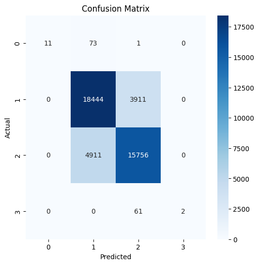

# VN30F1M Data Processing & Model Training

## 1. Giới thiệu
Dự án này thực hiện xây dựng một mô hình AI để dự đoán phần trăm thay đổi giá của VN30F trong các mốc 15 phút tiếp theo, liên tục cho đến hết ngày.

## 2. Sơ đồ Quy trình
Dữ liệu được xử lý theo các bước:
1. **Tiền xử lý dữ liệu** (Chuẩn hóa, tính toán biến động giá)
2. **Huấn luyện mô hình Random Forest**
3. **Đánh giá mô hình**

## 3. Biểu đồ Phân bố Nhãn
Dưới đây là biểu đồ phân bố nhãn trong tập huấn luyện:


## 4. Mã nguồn 
### Dưới đây là đoạn mã xử lý dữ liệu:

```python
!python data_processing.py --input OHLC_VN30F1M.csv --output processed_OHLC_VN30F1M.csv
```
Trong đó input là file chứ dữ liệu gốc, output là file chứa dữ liệu đã được tiền xử lý 
### Tiếp theo là huấn luyện và đánh giá mô hình 
```python
!python random_forest.py --input processed_random_forest.csv --output random_forest_model.pkl --seq_length 30 
```
Trong đó input là file dữ liệu đã tiền xử lý, output là model được lưu, seq_length là độ dài của chuỗi đầu vào (sequence length) dùng phương pháp cửa sổ trượt. 

## 5. Kết quả 


